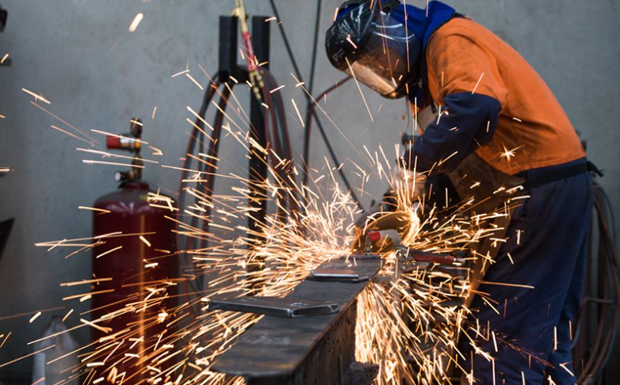

# Sandeep Enterprises

> Official website and digital business platform for Sandeep Enterprises — Fabrication & Erection, Sanaswadi, Pune, Maharashtra.



## 📌 About

**Sandeep Enterprises** is an industrial fabrication and erection business based in **Sanaswadi, Pune, Maharashtra**, with more than **25 years of experience** in the fabrication and erection field.

This project is a modern business website developed to provide an online presence for the company and make it easier for customers to:

- Explore fabrication and erection services
- View completed projects
- Browse work photographs
- Submit project enquiries
- Contact the business through WhatsApp
- Call the business directly
- Find the business location on Google Maps

The website also includes a secure **Admin Panel** for managing enquiries, projects and business photographs.

---

## 🌐 Website

**Sandeep Enterprises**

Fabrication & Erection  
Sanaswadi, Pune, Maharashtra

### Contact

- 📞 **Phone:** 9822193954
- 💬 **WhatsApp:** +91 98221 93954
- 📧 **Email:** sandeepenterprises4851@gmail.com
- 📍 **Location:** Sanaswadi, Pune, Tal. Shirur, Maharashtra

---

# ✨ Features

## 🏠 Public Website

### Home

- Professional industrial-focused design
- Hero section
- Company experience highlights
- Services overview
- Why Choose Us section
- Project portfolio
- Contact CTA
- WhatsApp integration

### About

Provides information about:

- Sandeep Enterprises
- Business experience
- Fabrication and erection capabilities
- Company approach and workmanship

### Services

The website currently presents multiple fabrication and erection services:

1. Structural Steel Fabrication
2. Industrial Shed Fabrication
3. Steel Erection
4. MS Fabrication
5. Staircases & Handrails
6. Platforms & Structures
7. Machinery Structures
8. Repair & Modification

### Projects

Customers can view:

- Project details
- Work type
- Project location
- Project year
- Project description
- Project photographs
- Project cover image

Each project can have its own collection of photographs.

### Gallery

A separate business gallery is available for general fabrication and erection photographs.

The gallery is independent from project-specific photographs.

### Contact

The contact page provides:

- Phone contact
- WhatsApp contact
- Email contact
- Business location
- Google Maps
- Customer enquiry form

Enquiries can be sent directly to WhatsApp.

---

# 🔐 Admin Panel

The project includes a dedicated admin panel for managing the website.

## Admin Features

### Dashboard

- View customer enquiries
- Search enquiries
- Filter enquiries by status
- View enquiry details
- Call customers
- Contact customers through WhatsApp

### Enquiry Management

Supported enquiry statuses include:

- New
- Contacted
- In Progress
- Completed

### Project Management

Admin can:

- Create projects
- Edit projects
- Delete projects
- Add project photographs
- Delete project photographs
- Select a cover photograph
- Remove a cover photograph

### Gallery Management

Admin can:

- Upload gallery photographs
- Manage business work photographs
- Delete gallery photographs

### Authentication

The admin panel is protected using authentication through Supabase.

---

# 🛠️ Tech Stack

## Frontend

- **Next.js 16**
- **React 19**
- **TypeScript**
- **Tailwind CSS 4**

## Backend / Database

- **Supabase**
- **PostgreSQL**
- **Supabase Authentication**
- **Supabase Storage**

## Deployment

- **Vercel**
- **GitHub**

## Development Tools

- VS Code
- Git
- GitHub
- npm

The current project uses Next.js `16.3.1`, React `19.2.8`, Tailwind CSS 4 and TypeScript. :contentReference[oaicite:1]{index=1}

---

# 📁 Project Structure

```text
sandeep-enterprises/
│
├── app/
│   │
│   ├── about/
│   │   └── page.tsx
│   │
│   ├── admin/
│   │   ├── dashboard/
│   │   ├── enquiries/
│   │   ├── gallery/
│   │   ├── login/
│   │   └── projects/
│   │
│   ├── contact/
│   │   └── page.tsx
│   │
│   ├── gallery/
│   │   └── page.tsx
│   │
│   ├── projects/
│   │   ├── [id]/
│   │   └── page.tsx
│   │
│   ├── services/
│   │   └── page.tsx
│   │
│   ├── globals.css
│   ├── layout.tsx
│   └── page.tsx
│
├── components/
│   ├── admin/
│   │   ├── AdminMobileNav.tsx
│   │   ├── AdminSidebar.tsx
│   │   ├── EnquirySearch.tsx
│   │   ├── GalleryImageDeleteButton.tsx
│   │   ├── GalleryImageUpload.tsx
│   │   ├── LogoutButton.tsx
│   │   ├── ProjectCoverButton.tsx
│   │   ├── ProjectDeleteButton.tsx
│   │   ├── ProjectEditForm.tsx
│   │   ├── ProjectForm.tsx
│   │   ├── ProjectImageDeleteButton.tsx
│   │   ├── ProjectImageUpload.tsx
│   │   └── StatusSelect.tsx
│   │
│   ├── Footer.tsx
│   ├── Navbar.tsx
│   ├── WhatsAppButton.tsx
│   └── proxy.ts
│
├── lib/
│   └── supabase/
│       ├── client.ts
│       └── server.ts
│
├── public/
│   └── images/
│       ├── hero.png
│       ├── service-01.png
│       ├── service-02.png
│       ├── service-03.jpeg
│       ├── service-04.jpeg
│       ├── service-05.jpeg
│       ├── service-06.jpeg
│       ├── service-07.jpeg
│       └── service-08.jpeg
│
├── package.json
├── package-lock.json
├── next.config.ts
├── tsconfig.json
├── eslint.config.mjs
├── postcss.config.mjs
└── README.md
